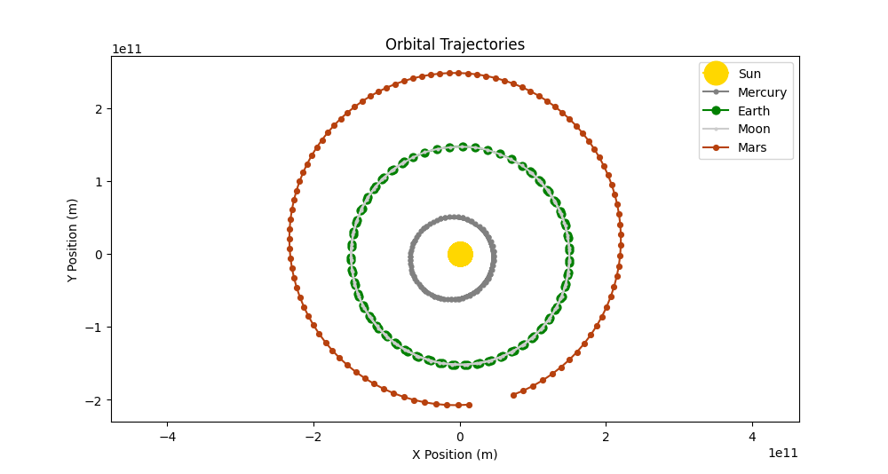
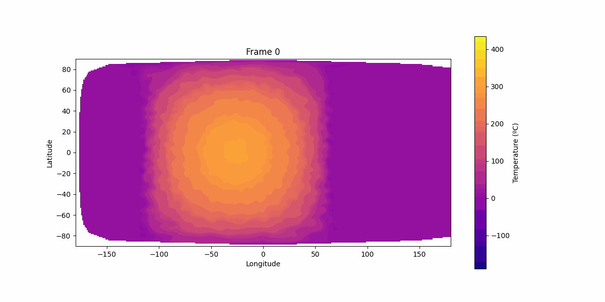

# Planetary Weather Simulator

## Overview
The Planetary Weather Simulator is a Python-based tool designed to model and visualize various planetary phenomena. It 
uses principles from astrophysics and thermodynamics to simulate celestial bodies, their interactions, and environmental 
features like terrain, atmosphere, and heat dynamics.

## Features
- **Simulate Celestial Bodies:** Stars, planets, and satellites with customizable parameters such as mass, radius, 
orbital data, and surface characteristics.
- **Dynamic Weather Modeling:** Model surface irradiance, heat flux, and atmospheric behaviors.
- **Visualizations:** Generate interactive plots for elevation, temperature, irradiance, and more.
- **Real-Time Physics:** Includes gravitational interactions and heat conduction dynamics for realistic simulations.

## File Structure

### Executables
- `run.py`: Entry point for running simulations and generating visualizations.
- `view.py`: Offers a command-line interface for generating and viewing plots.

### `src/`: Python Code
- `simulation.py`: Coordinates the entire simulation, managing time steps and updates.
- `plot.py`: Visualization and plotting, called from `run.py` and `view.py` 
<br><br>
- **`models/`: Modeling of physical objects and phenomena**
  - `stellar_system.py`: Manages celestial systems, gravitational forces, and orbital dynamics.
  - `celestial_body.py`: Base class for stars, planets, and satellites.
  - `planet.py`: Handles planet-specific logic.
  - `satellite.py`: Extends the `Planet` class for satellite-specific behaviors.
  - `star.py`: Describes stars and their properties.
  <br><br>
  - **`planetary/`: Aspects of an individual celestial body**
    - `surface.py`: Handles surface features and properties.
    - `atmosphere.py`: Models atmospheric layers and dynamics.
    - `thermodynamics.py`: Manages heat transfer and energy exchange.
    - `materials.py`: Loads and manages material properties from `materials.json`.
    - `adjacency_manager.py`: Builds adjacency matrices and Laplacians for spatial operations.
    - `air_data.py`: Arrays containing data on each point of the atmosphere at the current instant.
<br><br>
- **`math_utils/`: Mathematical utilities**
  - `geodesic_grid.py`: Creates geodesic grids for planetary surfaces and atmospheric layers.
  - `vector_utils.py`: Provides vector manipulation and transformation utilities.

### `data/`: Configuration and Input
- `bodies.json`: Contains definitions for celestial bodies (e.g., Earth, Mars, Sun).
- `materials.json`: Stores material properties (e.g., thermal conductivity, density).

## Requirements
This project requires Python 3.12 or higher and the following Python libraries:
- **Matplotlib** (3.9.2): For visualizations.
- **Noise** (1.2.2): Procedural generation of terrain using Perlin noise.
- **Numpy** (2.1.2): Numerical computations.
- **Scipy** (1.14.1): Scientific computations and optimizations.

Install all dependencies using:
```bash
pip install -r requirements.txt
```

## Usage
### Simulation
Run a simulation with:
```bash
python run.py [plot_type] [planet] [duration_sec] [timestep_sec] [time_between_snapshots_sec] [bodies_file]
```

- `plot_type`: Type of visualization (`orbits`, `temperature`, `irradiance`, etc.).
- `planet`: Name of the planet, from `bodies_file`.
- `duration_sec`: Total duration of the simulation, in seconds.
- `timestep_sec`: Time step duration, in seconds.
- `time_between_snapshots_sec` (optional): Time between snapshots (samples of the simulation that will appear in the 
final report). By default, equal to the time step.
- `bodies_file` (optional): File where celestial bodies are defined. By default, `data/bodies.json`.

### Visualization
Generate and view plots with:
```bash
python view.py [planet_name] [plot_type] [index] [duration] [timestep]
```

- `planet_name`: Name of the celestial body (e.g., Earth, Mars).
- `plot_type`: Type of plot (`elevation`, `atmosphere`, etc.).
- `index`: Index of the surface vertex (air column) being described in `atmosphere` plots, or of the layer of the 
atmosphere in `pressure`, `density` or `air_temperature` plots.
- `duration`: Duration in seconds, for plots that require running simulations.
- `timestep`: Time step, for plots that require running simulations.

## Examples
Simulate the orbits of the celestial bodies added so far over a period of slightly under one Martian year, with a time
step of 10 hours, and mark the bodies' positions 100 times:
```bash
python -m run orbits Sun 5.76e7 36000 5.76e5
```


View the elevation map of the Mars-like planet, in an equirectangular projection:
```bash
python view.py Mars
```


View the temperature, pressure, and density profiles of the atmosphere of the Mars-like planet:
```bash
python -m view Mars atmosphere
```


Simulate Mercury's surface temperature changes over a period of slightly under a Mercurian year, with a time step of ten
minutes, and visualize the results as an animation with one frame for every 24 hours:
```bash
python -m run temperature Mercury 7.5e6 600 86400
```


Simulate Mars' surface temperature changes over a period of three days, with a time step of one minute, and visualize 
the results as an animation with one frame for each hour:
```bash
python -m run temperature Mars 26.59e4 60 3600
```


## Contributing
Contributions are welcome! Feel free to fork the repository, submit issues, or open pull requests.

## License
This project is licensed under the MIT License.