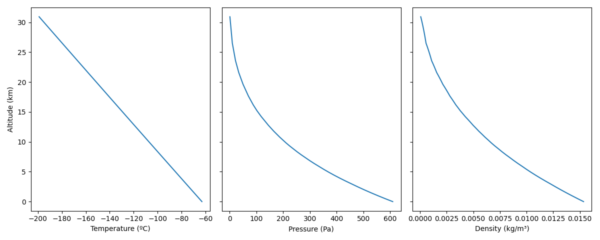

# Planetary Weather Simulator

## Overview
The Planetary Weather Simulator is a Python-based tool designed to model and visualize various planetary phenomena. It 
uses principles from astrophysics and thermodynamics to simulate celestial bodies, their interactions, and environmental 
features like terrain, atmosphere, and heat dynamics.

## Features
- **Simulate Celestial Bodies:** Stars, planets, and satellites with customizable parameters such as mass, radius, 
orbital data, and surface characteristics.
- **Dynamic Weather Modeling:** Model surface irradiance, heat flux, and atmospheric behaviors.
- **Visualizations:** Generate interactive plots for elevation, temperature, irradiance, and more.
- **Real-Time Physics:** Includes gravitational interactions and heat conduction dynamics for realistic simulations.

## File Structure
### Core Modules
- `surface.py`: Defines the surface features of celestial bodies using geodesic grids.
- `planet.py`: Implements planet-specific properties and behaviors.
- `atmosphere.py`: Models atmospheric layers, pressure, temperature, and heat exchange.
- `simulation.py`: Coordinates the entire simulation, managing time steps and updates.
- `stellar_system.py`: Manages the celestial system, including gravitational interactions.
- `star.py`: Describes stars and their attributes.
- `satellite.py`: Handles satellite dynamics.
- `vector_utils.py`: Provides utility functions for vector manipulations.

### Visualization
- `plot.py`: Handles data visualization for various simulation outputs (e.g., temperature maps, orbit plots).
- `view.py`: Offers a command-line interface for generating and viewing plots.

### Configuration and Data
- `bodies.json`: Contains definitions for celestial bodies (e.g., Earth, Mars, Sun).
- `materials.json`: Stores material properties (e.g., thermal conductivity, density).

### Execution
- `run.py`: Entry point for running simulations and generating visualizations.

## Requirements
### Python Libraries
- **Matplotlib**: For visualizations.
- **Noise**: Procedural generation of terrain using Perlin noise.
- **Numpy**: Numerical computations.
- **Scipy**: Scientific computations and optimizations.

Install all dependencies using:
```bash
pip install -r requirements.txt
```

## Usage
### Simulation
Run a simulation with:
```bash
python run.py [plot_type] [planet] [timestep] [n_steps] [steps_between_snapshots]
```

- `plot_type`: Type of visualization (`orbits`, `temperature`, `irradiance`, etc.).
- `planet`: Name of the planet from `bodies.json`.
- `timestep`: Time step in seconds.
- `n_steps`: Total number of simulation steps.
- `steps_between_snapshots`: Steps between saving data snapshots.

### Visualization
Generate and view plots with:
```bash
python view.py [planet_name] [plot_type] [index] [timestep] [n_steps]
```

- `planet_name`: Name of the celestial body (e.g., Earth, Mars).
- `plot_type`: Type of plot (`elevation`, `atmosphere`, etc.).
- `idx`: Index of the surface vertex (air column) being described in `atmosphere` plots, or of the layer of the 
atmosphere in `pressure`, `density` or `air_temperature` plots.

## Examples
Simulate the orbits of all celestial bodies added so far over a period of slightly under one Martian year, and mark the 
bodies' positions every 160 (36000 * 16 / 3600) hours:
```bash
python -m run orbits Sun 36000 1600 16 
```


View the elevation map of the Mars-like planet, in an equirectangular projection:
```bash
python view.py Mars
```


View the temperature, pressure, and density profiles of the atmosphere of the Mars-like planet:
```bash
python -m view Mars atmosphere
```


Simulate Mercury's surface temperature changes over a period of slightly under a Mercurian year, and visualize the 
results as an animation with one frame for every 24 hours:
```bash
python -m run temperature Mercury 900 8444 96
```


Simulate Mars' surface temperature changes over a period of four days, and visualize the results as an animation with 
one frame for each hour:
```bash
python run.py temperature Mars 600 1122 6
```


## Contributing
Contributions are welcome! Feel free to fork the repository, submit issues, or open pull requests.

## License
This project is licensed under the MIT License.